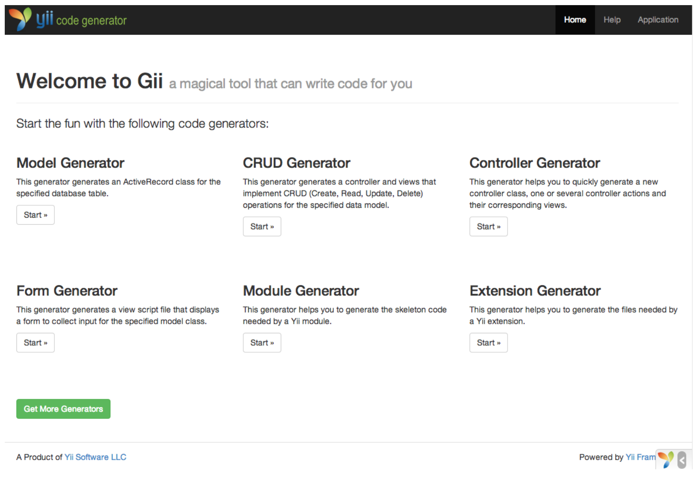
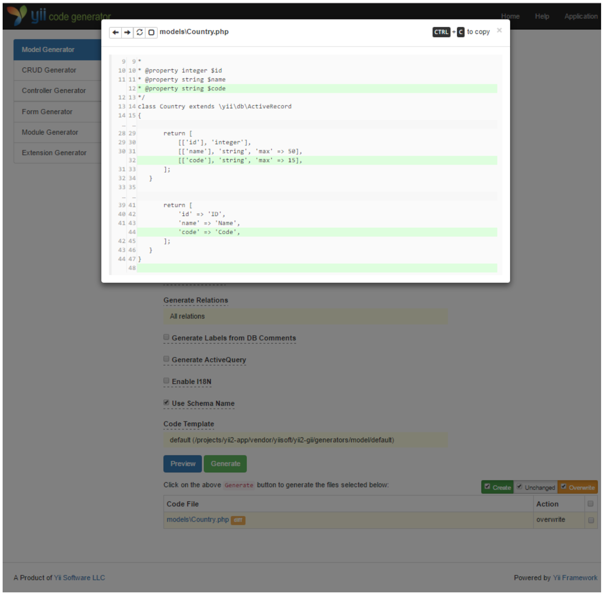
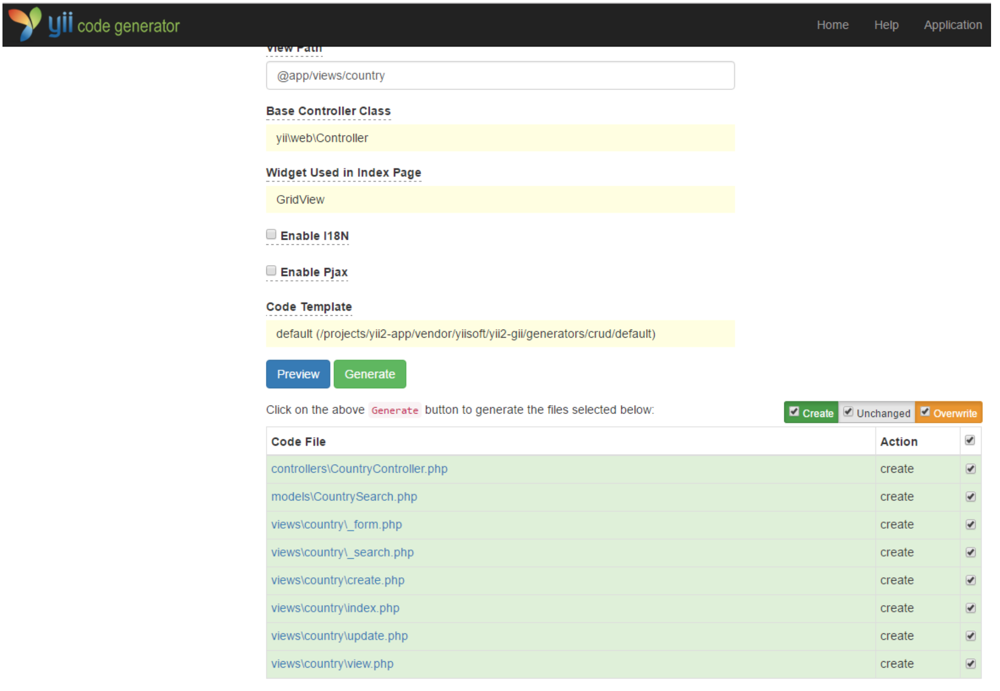
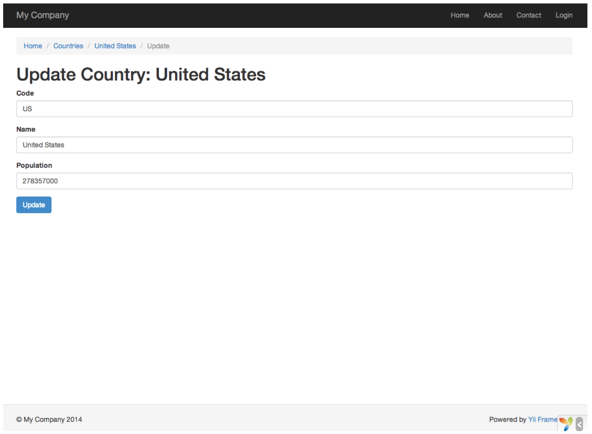

#Generare codice con ***Gii***


Questa sezione descrive come utilizzare ***Gii*** per generare automaticamente il codice che implementa alcune funzioni comuni del sito Web. Utilizzare Gii per generare codice in automatico è semplicemente una questione di immissione delle informazioni giuste per le istruzioni visualizzate nelle pagine Web Gii.
Attraverso questo tutorial, imparerai come:

- abilitare Gii nella tua applicazione,
- utilizzare Gii per generare una classe Active Record,
- utilizzare Gii per generare il codice che implementa le operazioni CRUD per una tabella DB,
- personalizzare il codice generato da Gii.


##Partiamo da Gii


Gii viene fornito da Yii come modulo. E' possibile abilitare Gii configurandolo nella proprietà dei moduli nell'applicazione. A seconda del modo in cui è stata creata l'applicazione, è possibile che il codice riportato di seguito sia già fornito nel file di configurazione ```config/web.php```.

    $config = [ ... ];

    if (YII_ENV_DEV) {
        $config['bootstrap'][] = 'gii';
        $config['modules']['gii'] = [
            'class' => 'yii\gii\Module',
        ];
    }

La configurazione soprastante indica che l'applicazione deve includere un modulo denominato ```gii```, che fa parte della classe **yii \ gii \ Module**.
Se selezioniamo l'entry script della nostra applicazione ( ```web/index.php```), troverete la seguente riga, il che rende essenzialmente ```YII_ENV_DEV``` a ```true```

    defined('YII_ENV') or define('YII_ENV', 'dev');

Grazie a questa linea di codica, la nostra applicazione è in modalità di sviluppo e sarà già abilitata a Gii per la configurazione precedentemente impostata da noi. Adesso è possibile accedere a Gii attraverso il seguente URL

    http://hostname/index.php?r=gii

!!!Warning
    Se accediamo a Gii da una macchina diversa da localhsot, l'accesso verrà negato come impostazione predefinita per scopi di protezione. E' possibile configurare Gii per aggiungere gli indirizzi IP consentiti, come segue:

    
        'gii' => [
            'class' => 'yii\gii\Module',
            'allowedIPs' => ['127.0.0.1', '::1', '192.168.0.*', '192.168.178.20'] // adjust this to your needs
        ],




##Generare una classe Active Record


Per utilizzare Gii nella generazione di una classe Active Record, dovete selezionare ***Model Generator*** (facendo click sul pulsante **Start**). Quindi compilare il modulo come segue:

- Nome della tabella: ```country```
- Classe del modello: ```Country```


Premendo il pulsante **Preview** vedrete il file ```models/Country.php``` che verrà creato dall'Active Record. Puoi anche cliccare sul nome del file per visualizzare l'anteprima del suo contenuto.
Quando si utilizza Gii, se si è già creato lo stesso file, lo sovrascriverà. Se premiamo il pulsante ```diff``` accanto al nome del fil, potrete vedere le differenze tra il codice che verrà generato e la versione esistente.



Quando sovrascriverete un file esistente, selezionate la casella accanto a **overwrite** e quindi fate clic sul pulsante **Generate**. Se invece si crea un nuovo file, è sufficiente fare clic sul pulsante **Generate**.
Successivamente, verrà visualizzata una pagina di conferma, per essere sicuri che il codice sia stato generato in modo corretto o meno. Se si avesse un file esistente, verrà visualizzato anche un messaggio dove verrà indicato che è stato sovrascritto il codice appena generato.


##Generazione codice di un CRUD


CRUD sta per ***Create - Read - Update - Delete***. Rappresentano le 4 attività comuni che si effettuano sui dati nella maggior parte dei siti Web. Per creare funzionalità CRUD usando Gii, dobbiamo selezione l'opzione **CRUD Generator** (nella pagina indice di Gii). Continuando con l'esempio dei "paesi", compiliamo il modulo come segue:

- Model Class: ```app\models\Country```
- Search Model Class: ```app\models\CountrySearch```
- Controller Class: ```app\controllers\CountryController```


Premendo il pulsante **preview**, verrà visualizzato un elenco di file da generare, come mostrato di seguito:



Se in precedenza avete creato i file ```controllers/CountryController.php``` e ```views/country/index.php``` nella sezione **Lavorare con i database**, dovete controllare la casella **overwrite** per sostituirli.

Per vedere se tutto quello che abbiamo fatto funziona, copiamo il seguente URL nel nostro browser

    http://hostname/index.php?r=country%2Findex

A questo punto vedrai una griglia di dati che mostra i paesi inseriti in precedenza nel nostro database. Puoi ordinare la griglia, oppure filtrarla immettendo le condizioni di filtro nelle intestazioni di colonna.
Per ogni paese visualizzato nella griglia, è possibile scegliere di visualizzarli, modificarli o elimiarli. Puoi anche scegliere di aggiungere un nuovo paese sul pulsante **Create Country** nella parte superiore della griglia.


Schermata relativa alla modifica di un paese:



Di seguito è riportato l'elenco dei file generati da Gii, nel caso in cui si desidera esaminare, implementare (o personalizzare) le funzionalità:

- Controller: ```controllers/CountryController.php```
- Models: ```models/Country.php``` e ```models/CountrySearch.php```
- Views: ```views/country/*.php```

!!!Tip
    ***Gii*** è stato progettato per essere uno strumento di generazione di codici estremamente personalizzabile e estensibile. Se utilizziamo ***Gii*** accelleriamo notevolmente la velocità nello sviluppo delle applicazioni.