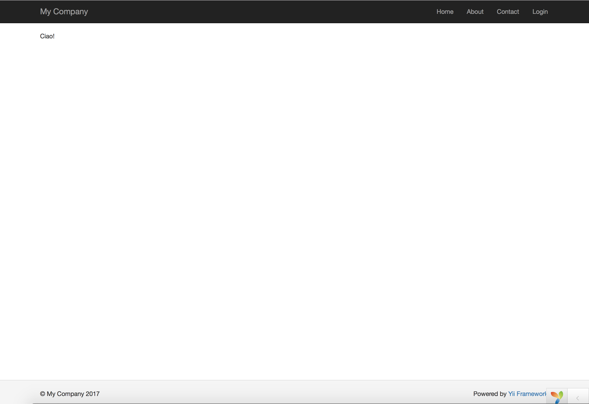

#Iniziamo con un "Ciao"

Questa sezione descrive come creare una nuova pagina "Ciao" nella nostra applicazione. Per effettuare ciò, dovremmo creare un'azione e una vista.
- L'applicazione invierà la richiesta di pagina all'azione
- e l'azione renderà a sua volta la visualizzazione della pagina all'utente finale con su scritta la parola "Ciao".

##Creazione di un'azione

Per l'attività che dovrà scrivere "Ciao", bisogna creare un'azione  ```say``` che legge un messaggio (```message```) come parametro dalla richiesta e visuallizza quel messaggio all'utente. Se la richiesta non fornisce un messaggio come parametro, l'azione visualizzerà come predefinito la parola "Ciao".

Le azioni devono essere dichiarate nella cartella "controllers". Per semplicità, puoi dichiarare l'azione ```say``` nell'esistente ```SiteController```. Questo controller è definito nel file che si trova in ```controllers/SiteControlle.php```. Ecco l'inizio della nostra azione:

    <?php

    namespace app\controllers;

    use yii\web\Controller;

    class SiteController extends Controller{
        
        // ...existing code...

        public function actionSay($message = 'Hello'){

            return $this->render('say', ['message' => $message]);
        
        }
    }

Nel codice precedente l'azione ```say``` viene definita in un metodo chiamato ```actionSay``` nella classe ```SiteController```. Yii utilizza il prefisso ```action``` per differenziare i metodi d'azione dai metodi non di azione in una classe di controller. Il nome dopo l'```action``` mappa l'ID dell'azione da effettuare.

Quando si tratta di denominare le azioni, è necessario capire come Yii tratta gli ID relativi all'azione che richiamiamo. I nomi/numeri relativi all'azione sono sempre indicati in minuscolo. Se un ID di un'azione è composto da più parole, verranno concatenate con i trattini ( per esempio, ```create-comment```). I nomi del metodo di un'azione vengono mappati rimuovendo i trattini dall'ID, capitalizzando la prima lettera di ogni parola con la parola ```action```. Ade esempio, l'ID associato all'azione ```create-comment``` corrisponde al nome del metodo dell'azione, che sarà ```actionCreateComment```.


##Creazione di una vista

Le viste(views) sono gli script che scrivi per generare una risposta ad una determinata azione e stampata a video. Per l'attività "Ciao", verrà creata una vista relativa al ```say``` che avrà il compito di stampare il valore contenuto in ```$message``` a video.

    <?php
    use yii\helpers\Html;
    ?>
    <?= Html::encode($message) ?>

La vista relativa al ```say``` deve essere salvata nel file ```views/site/say.php```.  Quando il metodo render() [inizializzato nel controller] verrà chiamato in un'azione, cercherà un file PHP denominato come segue:

```views/ControllerID/ViewsName.php```

Si noti che nel codice soprastante il parametro ```$message``` è codificato in HTML prima di essere stampato. Ciò è necessario poichè il parametro viene da un utente finale, rendendolo vulnerabile agli attacchi di "scripting cross-site(XSS)
" incorporando codice JavaScript dannoso all'interno del nostro parametro.

Dopo aver creato l'azione e la vista, puoi accedere alla nuova pagina tramite il seguente URL:

    http://hostname/index.php?r=site%2Fsay&message=Hello+World



Se tutto è andato bene, visualizzerete a video un messaggio con su scritto "Ciao!".  Questo perchè ```message``` viene passato come parametro al metodo nel Controller ```actionSay()```. Il layout della pagina  (intestazione e piè di pagina) resta il solito perchè il metodo render() incorpora automaticamente il risultato della vista del ```say``` in un layout di default, che si trova in ```views/layouts/main.php```.

Il parametro ```r``` nell'URL indicata sopra richiede ulteriori spiegazioni. Si tratta del percordo di un ID univoco dell'applicazione che si riferisce ad un'azione. Il formato del percordo è ```ControllerID/ActionID```. Quando l'azione riceve una richiesta, verifica questo parametro utlizzando la parte del ```ControllerID``` per determinare quale classe del controller deve essere instanziata per gestire la richiesta. A questo punto, il controllore userà la parte dell'```ActionID``` per determinare quale azione deve essere instanziata. Nel nostro esempio, il percordo ```site/say``` verrà controllato nel file ```SiteController``` usando l'ID dell'azione ```say```. Di conseguenza verrà richiamato il metodo ```actionSay()```.